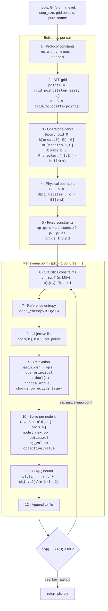

# SDIQKD
Code for SDI-QKD project on restricted information assumption

---

# `RI_bff_adv.jl`: entropy bounds under the restricted-information assumption

This section documents `two_meas/RI_bff_adv.jl` and `four_meas/RI_bff_adv.jl`. It assumes familiarity with PCPOP.jl (`@pcmonoid`, `@comms`, `Projector`, `basis_gen`, `npa_dual`, `model_new_obj`). It explains how each physical object and constraint of the paper's RI optimization maps to a Julia variable and a PCPOP call.

All six public functions in the two files run **the same pipeline with the same variable names**. They differ only in a few protocol constants (number of states, measurements and key bases) and in which physical parameter is swept. The pipeline is therefore described once, followed by a table of the per-function constants.

## Contents

1. [Physical problem](#1-physical-problem)
2. [Functions and protocol constants](#2-functions-and-protocol-constants)
3. [Pipeline (flow chart)](#3-pipeline)
4. [Stage-by-stage walkthrough](#4-stage-by-stage-walkthrough)
5. [Variable glossary](#5-variable-glossary)
6. [Constraint → PCPOP mapping](#6-constraint--pcpop-mapping)
7. [State and measurement conventions](#7-state-and-measurement-conventions)
8. [Output and usage](#8-output-and-usage)

---

## 1. Physical problem

Alice prepares one of `nstates` states $\rho_x$ with uniform prior $p_x = 1/\text{nstates}$. Bob performs one of `nmeas` binary measurements $\{M_{b|y}\}$ with detection efficiency $\eta$. The honest states have visibility $v$.

The device is characterized only by the **restricted-information (RI)** assumption: an upper bound $G$ on the probability of guessing $x$ from the prepared state,

$$
P_g^A=\max_{\{N_x\}}\sum_x p_x\operatorname{Tr}(\rho_x N_x)\le G .
$$

The key is extracted from Alice's bit $a$ in one or more *key bases*. Each key basis is a pair of states $(\rho_{x_1},\rho_{x_2})$ encoding $a=1,2$, measured by Bob with a fixed setting $y$. The functions return a lower bound on $H(A|E)$ computed with the BFF-type relaxation

$$
H(A|E)\;\ge\;\frac{1}{\ln 2}\Big[\operatorname{Tr}(\mathbb 1_A\otimes\rho_E-\rho_{AE})
+\sum_{k}\inf\operatorname{Tr}\big(P_k(\alpha_k\rho_{AE}+\beta_k\,\mathbb 1_A\otimes\rho_E)\big)\Big].
$$

In the tracial formulation, each term $k$ is the non-commutative polynomial optimization

$$
\begin{aligned}
\inf_{\rho_x,\,M_{b|y},\,P_{a,k},\,\sigma}\quad & \operatorname{Tr}F_k \\
\text{s.t.}\quad
&\rho_x-\rho_x^2\ge 0,\qquad \operatorname{Tr}\rho_x=1 &&\text{(valid, possibly mixed, states)}\\
&\sigma-p_x\rho_x\ge 0,\qquad \operatorname{Tr}\sigma\le G &&\text{(RI: } P_g^A\le\operatorname{Tr}\sigma\le G)\\
&M_{b|y}^2=M_{b|y},\qquad \textstyle\sum_b M_{b|y}=\mathbb 1 &&\text{(projective measurements)}\\
&\operatorname{Tr}(\rho_x M_{b|y})=p(b|x,y) &&\text{(observed statistics)}\\
&P_{a,k}^2=P_{a,k},\qquad [P_{a,k},M_{b|y}]=0 &&\text{(Eve's BFF projectors)}
\end{aligned}
$$

This is relaxed to an SDP by `PCPOP.npa_dual(...; tracial=true)`.

The key rate reported in the plots is $r=H(A|E)-H(A|B)$. The functions compute and store only $H(A|E)$. They compute $H(A|B)$ only to decide when to stop the sweep.

---

## 2. Functions and protocol constants

| File | Function | Protocol (states, meas.) | Swept | Fixed |
|---|---|---|---|---|
| `two_meas/RI_bff_adv.jl` | `cond_entropy_four_local_eta` | (4,2) | η | `G`, `v` |
| `two_meas/RI_bff_adv.jl` | `cond_entropy_four_local_visibility` | (4,2) | v | `G`, `η` |
| `four_meas/RI_bff_adv.jl` | `cond_entropy_four_local_eta` | (4,4) | η | `G`, `v` |
| `four_meas/RI_bff_adv.jl` | `cond_entropy_four_local_visibility` | (4,4) | v | `G`, `η` |
| `four_meas/RI_bff_adv.jl` | `cond_entropy_six_local_eta` | (6,4) | η | `G`, `v` |
| `four_meas/RI_bff_adv.jl` | `cond_entropy_six_local_visibility` | (6,4) | v | `G`, `η` |

The only places where the functions differ:

| Constant | (4,2) `two_meas` | (4,4) `four_meas`, `four_*` | (6,4) `four_meas`, `six_*` |
|---|---|---|---|
| `nstates` | 4 | 4 | 6 |
| `nmeas` | 2 | 4 | 4 |
| key bases $n_b$ (`nbasis`) | 1 (implicit) | 2 | 3 |
| Eve's projectors `E` | `E[2,0]` | `E[2*nbasis,0]` = 4 | `E[2*nbasis,0]` = 6 |
| Key-basis pairs → Eve projectors | (ρ₁,ρ₂)→`E[1:2]` | (ρ₁,ρ₂)→`E[1:2]`, (ρ₃,ρ₄)→`E[3:4]` | (ρ₁,ρ₄)→`E[1:2]`, (ρ₂,ρ₅)→`E[3:4]`, (ρ₃,ρ₆)→`E[5:6]` |
| Honest statistics | `prob_four` | `prob_four` | `prob_six` |
| $H(A\|B)$ | `conditional_entropy_four_A` | `conditional_entropy_four_A` (avg. over 2 bases) | `conditional_entropy_six_A` (avg. over 3 bases) |
| Entropy formula | `(1+obj_val)/log(2)` | `(2+obj_val)/(2*log(2))` | `(3+obj_val)/(3*log(2))` |
| Stop tolerance | 1e-6 | 1e-5 (η), 1e-6 (v) | 1e-5 (η), 1e-3 (v) |
| `pure` keyword | not available (always mixed) | available, default `false` | available, default `false` |

Shared helpers (defined at the top of each file):

- `obj_i_term_A(ρ, Pi, αi, βi)`: the BFF objective for **one** key basis and **one** grid node (see [Stage 8](#stage-8--objective-polynomials)).
- `obj_i_term_ua_A(...)` (`four_meas` only): the non-adaptive objective. It is not called by the six functions above.

External dependencies: `grid_points` and `grid_to_coeffs` in `utils.jl`, and the honest-model functions in `two_meas_corr.jl` / `four_meas_corr.jl`.

---

## 3. Pipeline



---

## 4. Stage-by-stage walkthrough

The code excerpts are taken from the `*_visibility` functions of `four_meas`. The other functions are identical up to the constants in [§2](#2-functions-and-protocol-constants).

### Stage 1: Protocol constants

```julia
nstates = 4      # number of Alice's preparations x
nmeas   = 4      # number of Bob's binary measurements y
nbasis  = 2      # number of key bases (four_meas only; two_meas has one)
```

### Stage 2: BFF grid

```julia
points = grid_points(step_size; start=start_grid, stop=stop_grid, uniform=uniform)
α, β   = grid_to_coeffs(points)
tot_points = length(points)
```

- `points` are the quadrature nodes $t_k\in[0,1]$ of the entropy relaxation. `uniform=true` gives an equally spaced grid. `uniform=false` gives nodes spaced by $\sqrt{\epsilon\,t}$, with `step_size` = $\epsilon$.
- `α[k]`, `β[k]` are the corresponding weights $\alpha_k,\beta_k$. `grid_to_coeffs` assumes `start_grid = 0` and `stop_grid = 1`.
- `tot_points` is the number of SDPs solved per sweep point. It controls both the tightness of the bound and the run time.

### Stage 3: Operator algebra

```julia
@pcmonoid M B[nmeas,0] E[2*nbasis,0] BE[nstates+1,0]
@comms B E
Projector.([B;E])
if pure
    Projector.(BE[1:nstates])
end
build(M)
```

| PCPOP call | Physical meaning |
|---|---|
| `B[nmeas,0]` | `nmeas` Hermitian letters. `B[y]` is Bob's outcome-1 projector $M_{1\|y}$. |
| `E[2*nbasis,0]` | Eve's BFF projectors $P^{(r)}_{a,k}$: two per key basis $r$ (one per key value $a$). The same letters are reused for every grid node $k$, which is valid because each $k$ is a separate SDP. |
| `BE[nstates+1,0]` | Letters that commute with neither `B` nor `E`: the states $\rho_x$ and the auxiliary operator $\sigma$. The name `BE` is only a group label. |
| `@comms B E` | $[P_{a,k},M_{b\|y}]=0$. Eve's and Bob's operators act on different subsystems. |
| `Projector.([B;E])` | $M_{b\|y}^2=M_{b\|y}$, $P_{a,k}^2=P_{a,k}$ (encoded as `:Projector` multiplication type in the graph-product monoid). |
| `Projector.(BE[1:nstates])` | Optional (`pure=true`, four_meas only): pure states $\rho_x^2=\rho_x$. |
| `build(M)` | Freezes the monoid. No further commutation or projector rules can be added after this. |

No relation is imposed on $\sigma$. It is a generic Hermitian letter, constrained only through `op_ge` and `tr_ge`.

### Stage 4: Physical operators

```julia
PB = [B[1] B[2] B[3] B[4]; 1-B[1] 1-B[2] 1-B[3] 1-B[4]]   # PB[b,y] = M_{b|y}
ρ  = BE[1:nstates]                                       # ρ[x] = ρ_x
σ  = BE[end]                                             # σ
```

- Each binary measurement is parameterized by its outcome-1 projector. Outcome 2 is `1-B[y]`, so completeness $\sum_b M_{b|y}=\mathbb 1$ and orthogonality $M_{1|y}M_{2|y}=0$ hold by construction.
- The states are unconstrained operators at this point. They become density operators through the constraints of stages 5 and 6.

### Stage 5: Fixed constraints (independent of the sweep)

```julia
op_ge = [σ - (1/nstates)*ρ[x] for x in 1:nstates]             # σ ≥ p_x ρ_x
tr_ge = [[-σ, -G]]                                            # Tr(−σ) ≥ −G  ⇔  Tr σ ≤ G
if !pure
    op_ge = vcat(op_ge, [ρ[x] - ρ[x]*ρ[x] for x in 1:nstates]) # 0 ≤ ρ_x ≤ 1
end
```

- **`op_ge`** holds operator inequalities $q\ge 0$. `npa_dual` builds one localizing matrix $\Upsilon_q=[\operatorname{Tr}(u^\dagger q\,v)]_{u,v\in\texttt{ops}}\succeq0$ for each.
  - $\sigma-p_x\rho_x\ge0$ together with $\operatorname{Tr}\sigma\le G$ implies $P_g^A\le\sum_x\operatorname{Tr}(\sigma N_x)=\operatorname{Tr}\sigma\le G$ for any POVM $\{N_x\}$. This is how the RI assumption is encoded.
  - $\rho_x-\rho_x^2\ge0$ bounds the spectrum of $\rho_x$ to $[0,1]$. Together with $\operatorname{Tr}\rho_x=1$, this is the tracial encoding of a (mixed) state of unspecified dimension.
- **`tr_ge`** holds linear trace constraints `[poly, c]` meaning $\operatorname{Tr}(\text{poly})\ge c$.

### Stage 6: Sweep and statistics constraints

```julia
plx = [v_start - i/100 for i in 0:100]        # (eta_start in *_eta functions)
for i in 1:length(plx)
    v = plx[i]                                # (η = plx[i] in *_eta functions)
    tr_eq = [[ρ[x]*PB[1,y], prob_four(1, x, y, η; v=v, bin=true)] for x in 1:nstates for y in 1:nmeas]
    tr_eq = vcat(tr_eq, [[ρ[x], 1] for x in 1:nstates])
```

- **`tr_eq`** holds linear trace equalities `[poly, c]` meaning $\operatorname{Tr}(\text{poly})=c$:
  - $\operatorname{Tr}(\rho_x M_{1|y})=p(1|x,y)$ for all $x,y$. Outcome 2 is implied by normalization.
  - $\operatorname{Tr}\rho_x=1$.
- `prob_four` / `prob_six` compute the honest $p(b|x,y)=\operatorname{Tr}(\rho_x^{v}M^{\eta}_{b|y})$ from `*_corr.jl`, with noisy states $\rho_x^{v}=v\lvert\psi_x\rangle\langle\psi_x\rvert+(1-v)\mathbb1/2$ and lossy POVMs.
- **Binning.** `bin=true` assigns Bob's no-click event to outcome 1, $M^{\eta}_{1|y}=\eta M_{1|y}+(1-\eta)\mathbb1$. The SDP therefore sees only binary statistics. Coarse-graining can only lower the bound, so it stays valid.
- `npa_dual` is called with `normalize=false`, so no $\operatorname{Tr}\mathbb 1=1$ constraint is added. States are normalized by $\operatorname{Tr}\rho_x=1$ instead.

### Stage 7: Reference entropy

```julia
cond_entropy = conditional_entropy_four_A(η; v=v, bin=false)
```

$H(A|B)$ of the honest model restricted to the key basis/bases, with **unbinned** (three-outcome) statistics because Bob does observe the no-click event. For multiple key bases it is the average over bases. It is used only for the stopping rule in Stage 12.

### Stage 8: Objective polynomials

```julia
function obj_i_term_A(ρ, Pi, αi, βi)
    res_αi = Pi[1]*ρ[1] + Pi[2]*ρ[2]
    res_βi = (Pi[1] + Pi[2])*(ρ[1] + ρ[2])
    return -0.5*(αi*res_αi + βi*res_βi)
end

objs1 = [obj_i_term_A(ρ[1:2], E[1:2], α[k], β[k]) for k in 1:tot_points]   # key basis 1
objs2 = [obj_i_term_A(ρ[3:4], E[3:4], α[k], β[k]) for k in 1:tot_points]   # key basis 2
objs  = objs1 + objs2                                                      # element-wise
```

**Derivation.** For a key basis with states $(\rho_{x_1},\rho_{x_2})$ encoding $a=1,2$ with $p_a=\tfrac12$, the cq-state is $\rho_{AE}=\tfrac12\sum_a\lvert a\rangle\langle a\rvert\otimes\rho_{x_a}$ and $\rho_E=\tfrac12(\rho_{x_1}+\rho_{x_2})$. With $P_k=\sum_a\lvert a\rangle\langle a\rvert\otimes P_{a,k}$:

$$
\operatorname{Tr}\big(P_k(\alpha_k\rho_{AE}+\beta_k\mathbb 1_A\otimes\rho_E)\big)
=\tfrac12\Big[\alpha_k\textstyle\sum_a\operatorname{Tr}(P_{a,k}\rho_{x_a})+\beta_k\operatorname{Tr}\big((P_{1,k}+P_{2,k})(\rho_{x_1}+\rho_{x_2})\big)\Big].
$$

`res_αi` and `res_βi` are exactly the two traced polynomials: `Pi` = $(P_{1,k},P_{2,k})$ and `ρ` = $(\rho_{x_1},\rho_{x_2})$. The prefactor `-0.5` is $p_a=\tfrac12$ with the sign convention of the weights returned by `grid_to_coeffs`.

**Several key bases.** `objs1 + objs2 (+ objs3)` is element-wise vector addition. `objs[k]` is therefore the node-$k$ objective **summed over key bases**. It shares $\rho_x$, $M_{b|y}$ and $\sigma$ across bases, but each basis has its own disjoint Eve projectors. One SDP per node thus bounds all bases jointly.

### Stage 9: Relaxation

```julia
ops, ops_principal = basis_gen(objs[1], level, [], op_ge, tr_eq, tr_ge, M.vertices, -1)
model, S, V, mons, LMI = npa_dual(0, ops, ops_principal;
        op_ge=op_ge, tr_eq=tr_eq, tr_ge=tr_ge,
        min=true, tracial=true, normalize=false, change_objective=true, progress=true)
```

| Argument / return | Meaning here |
|---|---|
| `level` (default `"1+B*E"`) | Monomial set $S$ of the relaxation: the identity, all single letters (`B`, `E`, `ρ`, `σ`) and all products `B[y]*E[j]`. |
| `[]` (`op_eq`) | No operator equalities. Projectivity and commutation are enforced by the monoid itself. |
| `M.vertices` | All letters of the monoid, used to generate the monomials of `level`. |
| `-1` (`lvl_lm`) | Automatic localizing level: `ops` is the monomial set at `level`, and `ops_principal` is `ops` extended by products with the letters appearing in `op_ge` (degree ⌈deg q / 2⌉ = 1). This makes each localizing matrix a principal submatrix of the moment matrix. |
| `ops_principal` | Index set of the moment matrix $\Gamma=[\operatorname{Tr}(u^\dagger v)]$. |
| `ops` | Index set of each localizing matrix $\Upsilon_q$, one per element of `op_ge`. |
| `obj = 0` | The model is built without an objective. The objective is inserted in Stage 10. |
| `min=true` | Minimization. Internally `s = -1`, and the dual SDP is a maximization whose value lower-bounds the infimum. |
| `tracial=true` | Cyclic moments: $\operatorname{Tr}(uv)=\operatorname{Tr}(vu)$ identifies moment entries. |
| `change_objective=true` | Also returns `S`, `V`, `mons` and `LMI`, so the objective can be swapped without rebuilding. |
| `S` | Dual polynomial identity, $-\text{obj} + \sum Z_{\text{eq}}\,\text{tr\_eq} - s\sum Z_{\text{ge}}\,\text{tr\_ge}$, matched against the LMI blocks. |
| `V` | Constraint references generated from `S` (the objective-dependent part of the model). |
| `LMI`, `mons` | Moment/localizing blocks and the set of reduced trace monomials. |

The relaxation is rebuilt at every sweep point because `tr_eq` changes with $\eta$ or $v$. It is **not** rebuilt per grid node.

### Stage 10: Per-node solves

```julia
obj_val = 0
old_obj = 0
for obj in objs
    S = S + old_obj - obj                    # replace −old_obj by −obj in the dual identity
    model, V = model_new_obj(model, S, V, mons, LMI, -1)
    set_optimizer(model, optimizer)
    optimize!(model)
    obj_val += objective_value(model)        # ≈ inf Tr F_k
    old_obj = obj
end
```

- `model_new_obj` deletes the constraints `V` and regenerates them from the updated `S`. Only the objective changes between nodes.
- Each node is solved independently, and the values are summed: $\sum_k\inf\operatorname{Tr}F_k\le\inf\sum_k\operatorname{Tr}F_k$. This is the "localized objective" referred to in the docstrings. It is still a valid lower bound and keeps each SDP small.

### Stage 11: Entropy bound

```julia
ply[i] = (2+obj_val)/(2*log(2))   # written with the literal n_b: (1+·)/ln2, (2+·)/(2ln2), (3+·)/(3ln2)
```

For each key basis, $\operatorname{Tr}(\mathbb 1_A\otimes\rho_E-\rho_{AE})=2\cdot1-1=1$, so the constant term summed over bases is $n_b$. Dividing by $n_b$ averages over the key bases. `ply[i]` is the bound on $H(A|E)$ in bits.

### Stage 12: Output and stopping rule

```julia
fpath = fname * "v=$(round(v;digits=2))/4Alice_$(level)_G=$(round(G;digits=2)).txt"   # "eta=…" in *_visibility
mkpath(dirname(fpath))
open(fpath, "a") do file
    write(file, "$(plx[i]) $(ply[i])\n")
end
if ply[i] - cond_entropy < tol
    break
end
```

Each sweep point appends one line `x  H(A|E)` to `fpath`. The sweep stops once $H(A|E)-H(A|B)$ falls below `tol`, i.e. once the key rate is no longer positive. The functions return `plx, ply`. Entries of `ply` after the break keep their initial value `1.0` and should be ignored.

---

## 5. Variable glossary

Every function uses these names with the same meaning.

**Inputs**

| Variable | Symbol | Meaning |
|---|---|---|
| `G` | $G$ | Upper bound on Alice's guessing probability $P_g^A$ (RI parameter). $G=1/\text{nstates}$ is the fully restricted case. |
| `v` | $v$ | Visibility of the honest states, $\rho_x^{v}=v\lvert\psi_x\rangle\langle\psi_x\rvert+(1-v)\mathbb 1/2$. |
| `η` | $\eta$ | Bob's detection efficiency. |
| `level` | — | Relaxation level string passed to `basis_gen`. |
| `step_size`, `start_grid`, `stop_grid`, `uniform` | $\{t_k\}$ | BFF grid parameters. |
| `eta_start` / `v_start` | — | First value of the sweep (decreasing in steps of 0.01). |
| `pure` | — | `true`: states are projectors. `false`: mixed states via $\rho_x-\rho_x^2\ge0$. |
| `fname` | — | Output directory prefix. |
| `optimizer` | — | JuMP optimizer (Mosek by default). |

**Internal**

| Variable | Symbol | Meaning |
|---|---|---|
| `nstates`, `nmeas`, `nbasis` | $\lvert X\rvert$, $\lvert Y\rvert$, $n_b$ | Protocol constants. |
| `points` | $t_k$ | Grid nodes. |
| `α`, `β` | $\alpha_k,\beta_k$ | BFF weights. |
| `tot_points` | — | Number of grid nodes, i.e. SDPs per sweep point. |
| `M` | — | PCPOP graph-product monoid holding all letters. |
| `B[y]`, `PB[1,y]` | $M_{1\lvert y}$ | Bob's outcome-1 projector. |
| `1-B[y]`, `PB[2,y]` | $M_{2\lvert y}$ | Bob's outcome-2 projector. |
| `E[2r-1]`, `E[2r]` | $P^{(r)}_{1,k},P^{(r)}_{2,k}$ | Eve's BFF projectors for key basis $r$. |
| `ρ[x]` = `BE[x]` | $\rho_x$ | Alice's prepared state (dimension-free). |
| `σ` = `BE[end]` | $\sigma$ | Auxiliary operator certifying $P_g^A\le\operatorname{Tr}\sigma$. |
| `op_ge` | $q\ge0$ | Operator inequalities → localizing matrices. |
| `tr_ge` | $\operatorname{Tr}(\cdot)\ge c$ | Linear trace inequalities. |
| `tr_eq` | $\operatorname{Tr}(\cdot)=c$ | Linear trace equalities (statistics and normalization). |
| `plx` | $\eta$ or $v$ | Sweep values. |
| `cond_entropy` | $H(A\lvert B)$ | Honest error-correction cost (unbinned). |
| `objs`, `objs1..3` | $F_k$ | Objective polynomials per node (per key basis before summation). |
| `ops`, `ops_principal` | $S$ | Monomial index sets of the localizing and moment matrices. |
| `model`, `S`, `V`, `mons`, `LMI` | $\Gamma,\Upsilon_q$ | Dual SDP and its objective-swap handles. |
| `obj_val` | $\sum_k\inf\operatorname{Tr}F_k$ | Accumulated optimal values. |
| `ply` | $H(A\lvert E)$ | Lower bound in bits for each sweep point. |
| `fpath` | — | Output file. |

---

## 6. Constraint → PCPOP mapping

| Physical constraint | Where it lives | Code |
|---|---|---|
| $M_{b\lvert y}^2=M_{b\lvert y}$ | monoid rule | `Projector.(B)` |
| $\sum_b M_{b\lvert y}=\mathbb 1$, $M_{1\lvert y}M_{2\lvert y}=0$ | parameterization | `PB[2,y] = 1-B[y]` |
| $P_{a,k}^2=P_{a,k}$ | monoid rule | `Projector.(E)` |
| $[P_{a,k},M_{b\lvert y}]=0$ | monoid rule | `@comms B E` |
| $\rho_x^2=\rho_x$ (pure only) | monoid rule | `Projector.(BE[1:nstates])` |
| $\rho_x-\rho_x^2\ge0$ (mixed) | localizing matrix | `op_ge` |
| $\sigma-p_x\rho_x\ge0$ | localizing matrix | `op_ge` |
| $\operatorname{Tr}\sigma\le G$ | linear constraint | `tr_ge = [[-σ,-G]]` |
| $\operatorname{Tr}\rho_x=1$ | linear constraint | `tr_eq` |
| $\operatorname{Tr}(\rho_x M_{1\lvert y})=p(1\lvert x,y)$ | linear constraint | `tr_eq` |
| Cyclicity $\operatorname{Tr}(uv)=\operatorname{Tr}(vu)$ | moment identification | `npa_dual(…; tracial=true)` |
| Moment matrix $\Gamma\succeq0$ | PSD block | `ops_principal` |

---

## 7. State and measurement conventions

Defined in `two_meas/two_meas_corr.jl` and `four_meas/four_meas_corr.jl`.

| Protocol | States `x` | Measurements `y` | Key (states; setting) |
|---|---|---|---|
| (4,2) | 1 → $\lvert0\rangle$, 2 → $\lvert1\rangle$, 3 → $\lvert+\rangle$, 4 → $\lvert-\rangle$ | 1 → Z, 2 → π/8 | (1,2; y=1) |
| (4,4) | as (4,2) | 1 → Z, 2 → +π/8, 3 → −π/8, 4 → X | (1,2; y=1), (3,4; y=4) |
| (6,4) | 1,2,3 → $\lvert0\rangle,\lvert+\rangle,\lvert\pi/8\rangle$; 4,5,6 → orthogonal partners | 1 → Z, 2 → X, 3 → +π/8, 4 → −π/8 | (1,4; y=1), (2,5; y=2), (3,6; y=3) |

The index of the X measurement differs between `povm_four` (y = 4) and `povm_six` (y = 2).

---

## 8. Output and usage

Output files contain two columns, the swept parameter and the lower bound on $H(A|E)$ in bits:

```
1.0  0.9999264850777991
0.99 0.9216597639180786
...
```

Default locations (relative to the script directory):

| File | `*_eta` | `*_visibility` |
|---|---|---|
| `two_meas` | `plots/Guess_prob/von_neumann/eta/v=<v>/4Alice_<level>_G=<G>.txt` | `plots/Guess_prob/von_neumann/visibility/eta=<η>/4Alice_<level>_G=<G>.txt` |
| `four_meas` (4,4) | `plots/Guess_prob/von_neumann/eta/adapt/v=<v>/4Alice_…` | `plots/Guess_prob/von_neumann/visibility/adapt/eta=<η>/4Alice_…` |
| `four_meas` (6,4) | `plots/Guess_prob/von_neumann/eta/adapt/v=<v>/6Alice_…` | `plots/Guess_prob/von_neumann/visibility/adapt/eta=<η>/6Alice_…` |

Files are opened in append mode, so re-running a function adds lines to an existing file.

Example:

```julia
cd("four_meas")
include("RI_bff_adv.jl")

# H(A|E) versus visibility for the (4,4) protocol at G = 0.5, η = 1
plx, ply = cond_entropy_four_local_visibility(0.5, 1.0)

# H(A|E) versus η for the (6,4) protocol at G = 0.34, v = 1, finer BFF grid
plx, ply = cond_entropy_six_local_eta(0.34, 1.0; step_size=0.05)
```
